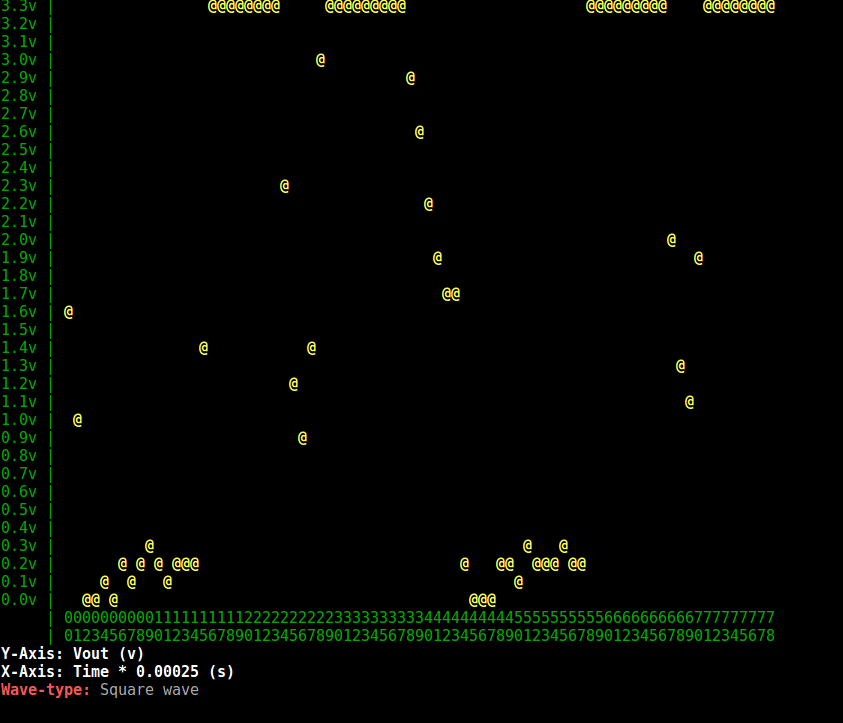
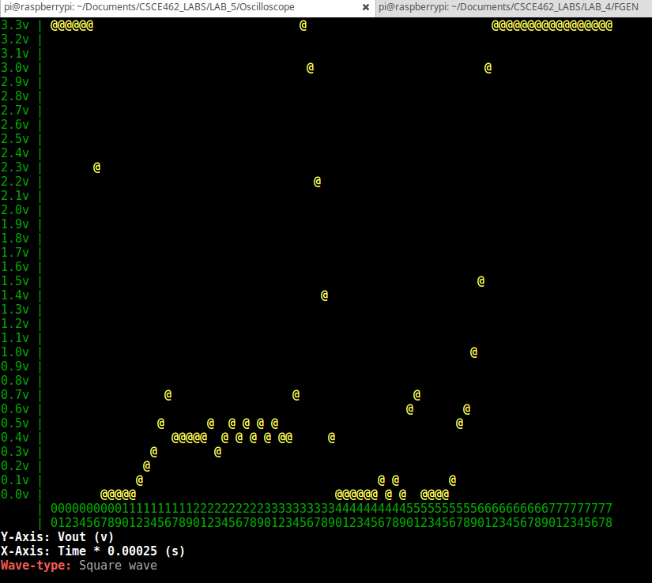
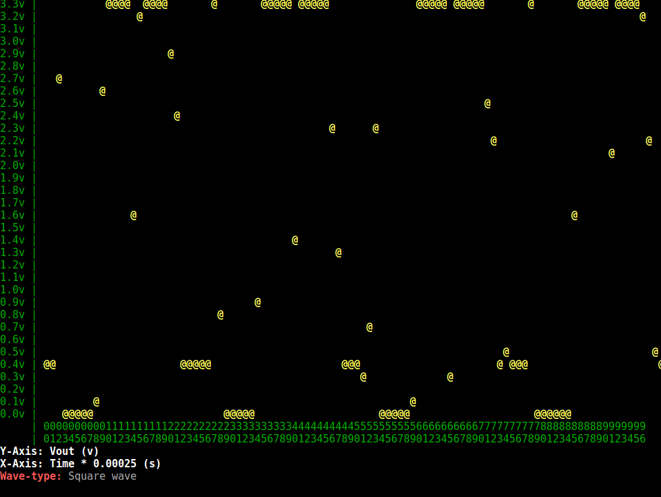

# RPi-Oscilloscope
ADC Raspberry Pi oscilloscope code for SPI device interface using C ncurses.  
  
Setting up the SPI device file is credited to: halherta  
> https://github.com/halherta/RaspberryPi-mcp3008spi  
  
## Compiling

Enable SPI on your Pi: `sudo raspi-config`  

Make sure ncurses is installed on your Pi  
`sudo apt-get install libncurses5-dev`  

Type `make` in the directory of the makefile  

## Wiring

Soon  

Run the output in the bin directory.  
`./outbin`  

## Demo

  
  
  
  
  
  
